# MARIAM: Swarmie -> GiANT Hardware Modifications

## Wheels
The [original swarmie wheels](http://www.robotshop.com/en/28-talon-tires-pair.html) were determined to be problematic as they can deflect depending on the load and orientation of the arm

### Onshape model
| Outside View | Inside View | Side View |
| ----- | ---- | ---- |
| 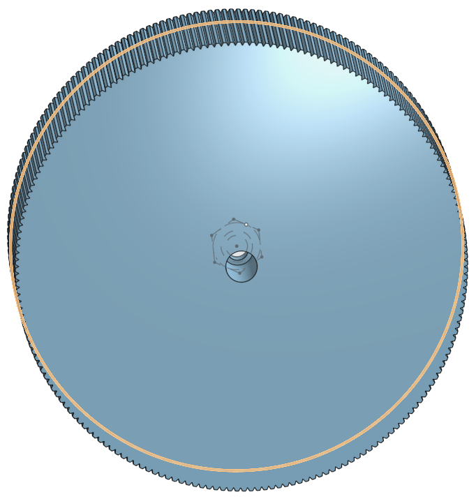 | 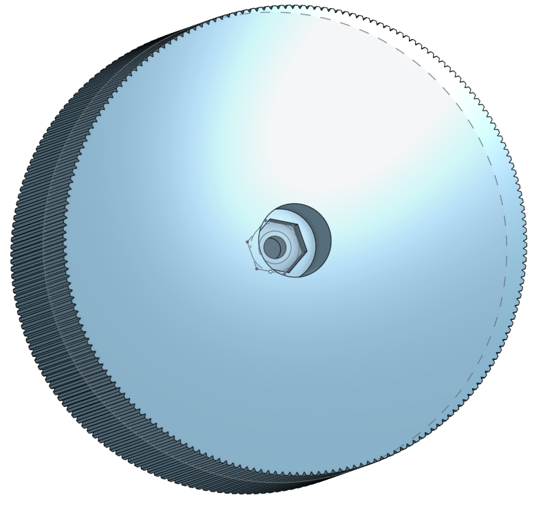 | 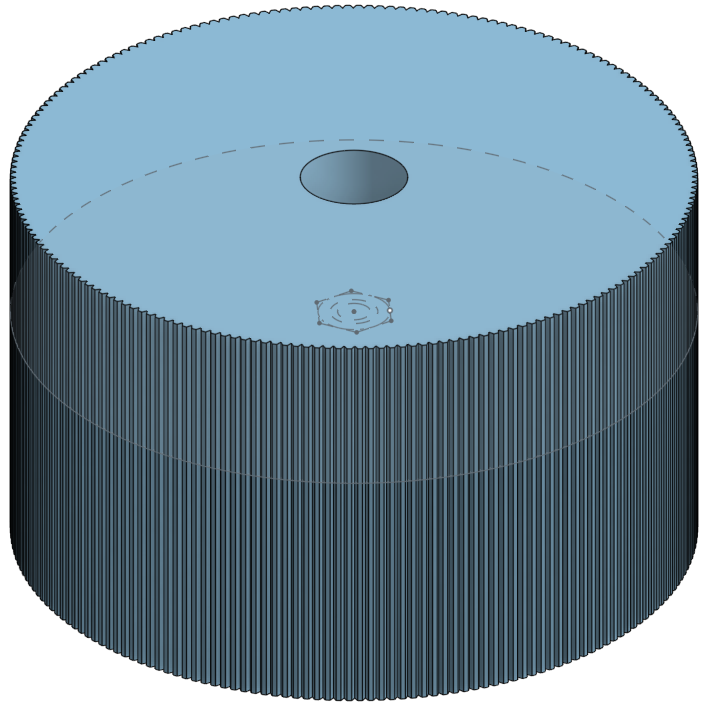 |

[onshape Wheel export link](https://cad.onshape.com/documents/aa2da9a48629a0e970e740cf/w/182c53c30d571fb9a61701d0/e/186008342aef2fcef0ebdad8?renderMode=0&uiState=659b89c2f9a26c55e09e2aa0)  
Export the stl binary with millimeter as the units.
Using the Lulzbot's Cura https://lulzbot.com/support/cura (You can't use the normal cura for the taz) created the gcode to print using the lab's lulzbot taz 6 The wheels were printed with 20% infill at high-speed.  
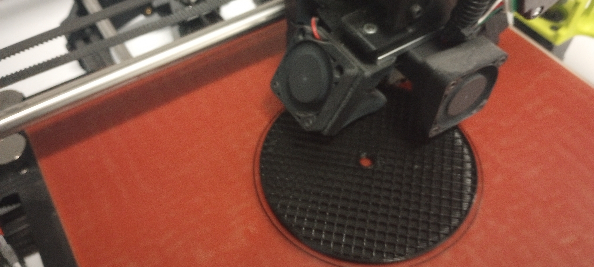

Mounted the wheels.  
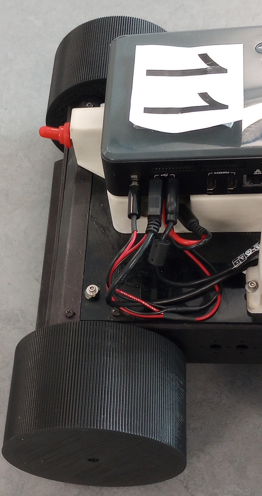 

The wheels were then deemed to be too slippery on the smooth lab floor.

### When using these products please ensure you have adequate ventilation!
| Plastidip Spray | Can of Plastidip | Paint Brush |
| ----- | ---- | ---- |
| 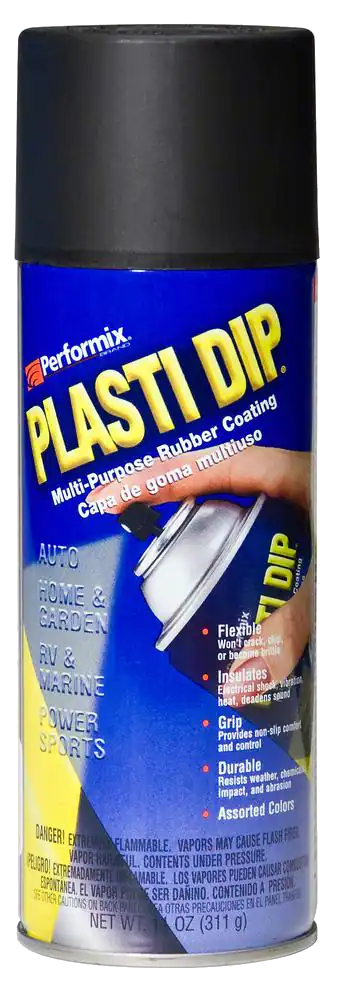 | 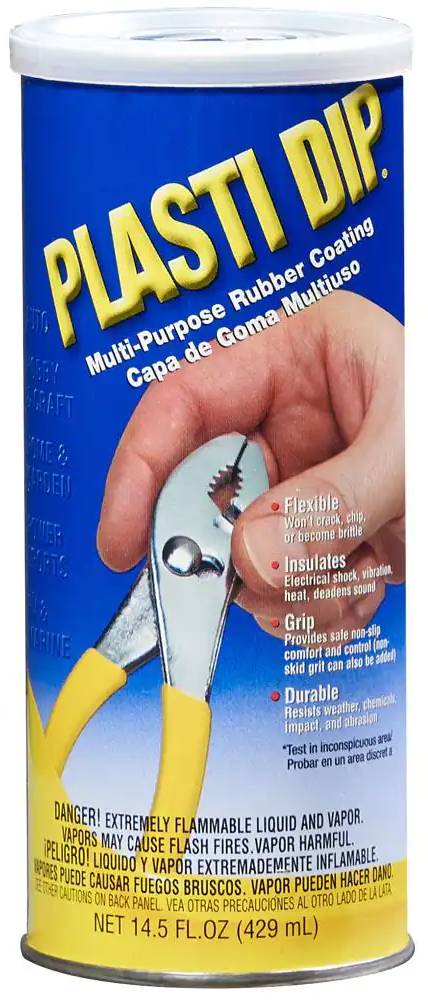 | 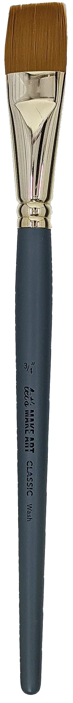 |

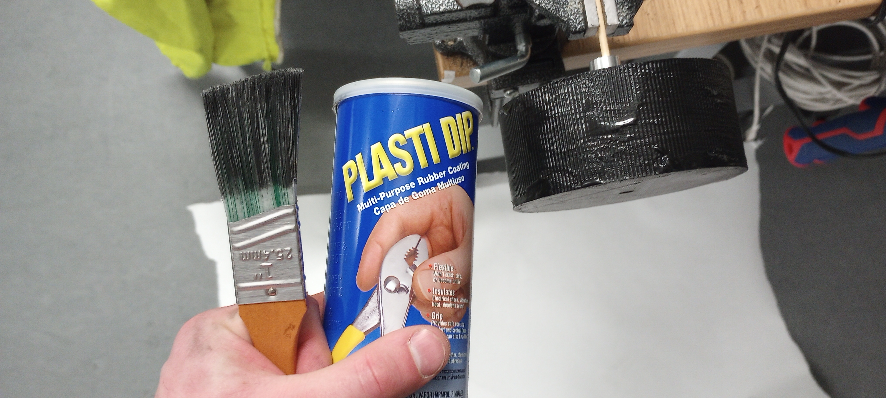
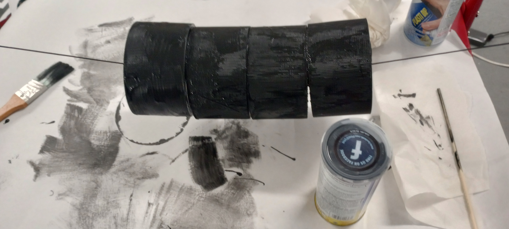 

I have found that the spray was much easier to get an even coat sprayed wheels have 4 coats. 

## Arduino A* -> Teensy 4.0
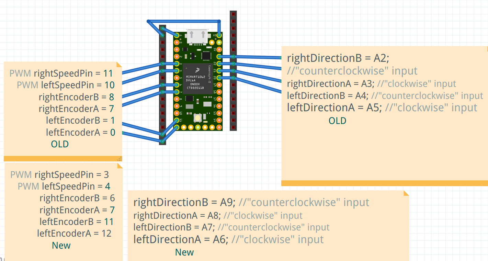
Pins with jumpers looks like this note there is an extra pin #8 that is unneeded
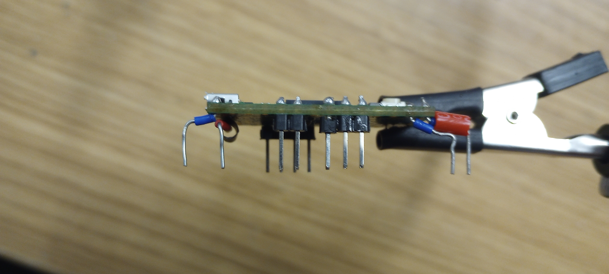

### Teensy plugged in 
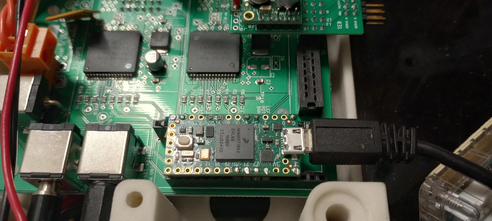

### Hot-glue board down to avoid it wiggling unplugged
Be generous with the hot-glue
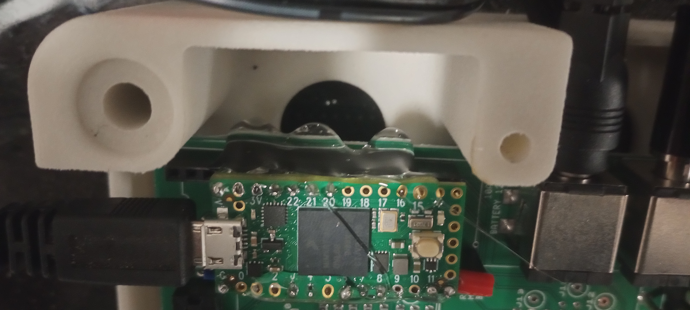
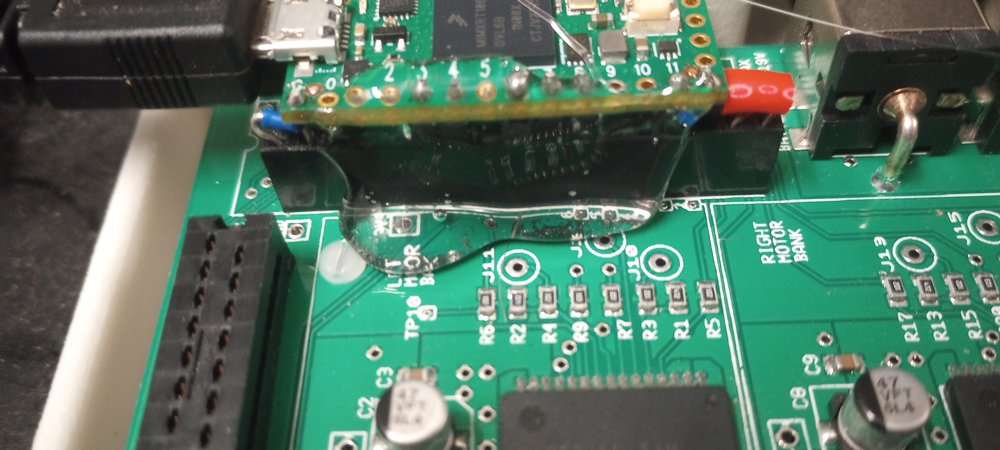

## Arm
- Remove front cattle catcher with the 2 dof gripper

[Onshape document for arms and mast](https://cad.onshape.com/documents/5bdef1b60ea48259ed563a84/w/59b52437c277f16a30fa819d/e/b434ff057a653b377a0a916b?renderMode=0&uiState=659ba3b5308be67668e967e0)
Print options were most likely 100% infill at high detail
|Arm Adapter Plate Front | Arm Adapter Plate Back |
| ----- | ---- |
| 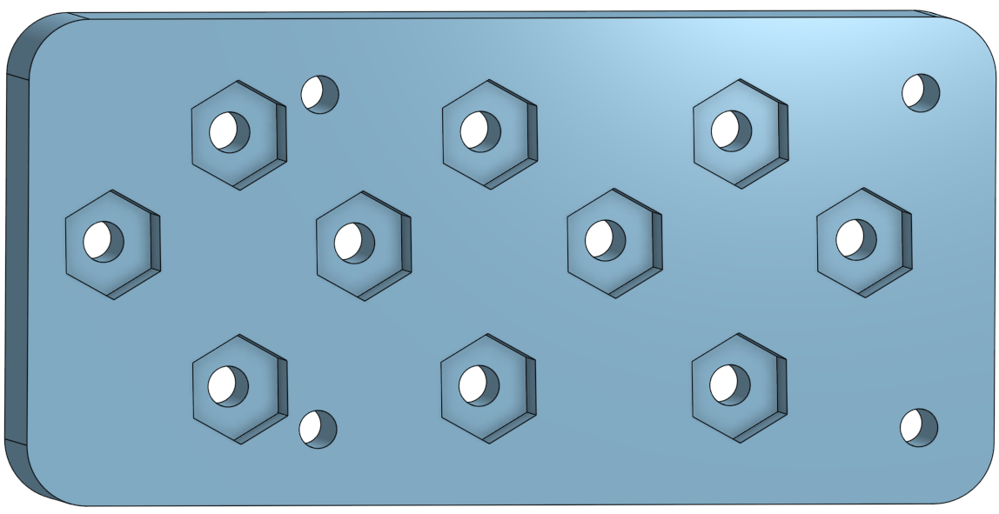 | 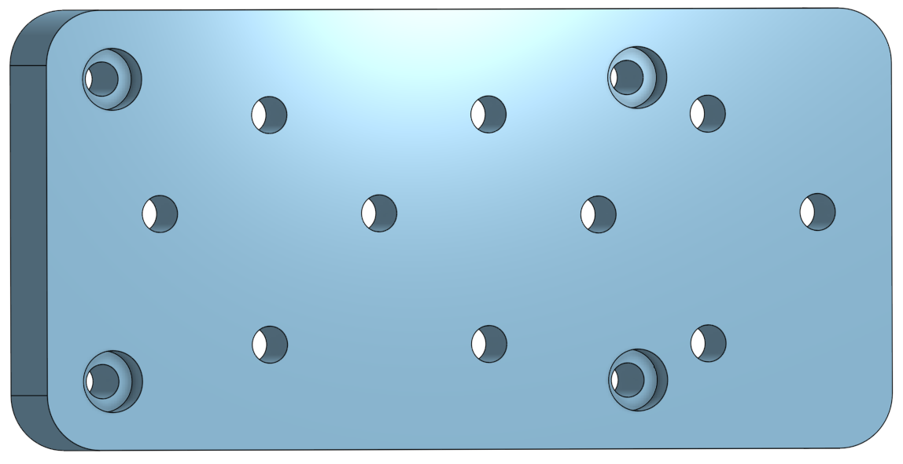 |

[Interbotix PX100 Arm](https://www.trossenrobotics.com/docs/interbotix_xsarms/specifications/px100.html)  
- Remove the arm and its power distribution and controller from the base plate it is shipped with
- Using the hardware from the baseplate the arm comes with mount the arm first to the adapter plate
- Using the same Nyloc nuts and bolts for the front and back cattle catchers you can mount the adapter plate to the robot frame.  
It should look like this
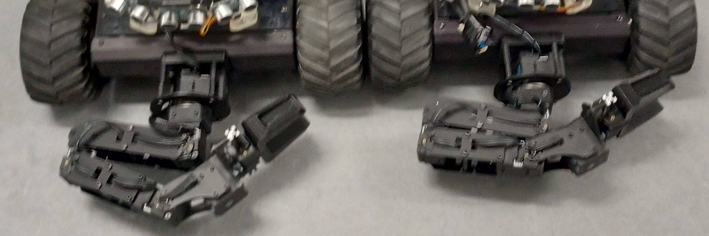

## Removal Camera, Sonar, IMU & GPS
  If you remove the Top plate the 4 phillips bolts.  
  Then using the 3/32” Hex Key and a ¼" Nut Driver you can then remove the Ultra Sound Tower from the top plate. 
  
  
  You can also unplug and remove the IMU ie. the AltIMU-10 v4 Inertial Measurement Unit	https://www.pololu.com/product/2470
  You can leave the sonars attached to the tower Parallax PING sonar sensor https://www.pololu.com/product/1605

## Realsence and tag mast
### Design In Progress
[Onshape document for arms and mast](https://cad.onshape.com/documents/5bdef1b60ea48259ed563a84/w/59b52437c277f16a30fa819d/e/b434ff057a653b377a0a916b?renderMode=0&uiState=659ba3b5308be67668e967e0)
The depth bounds on the Realsence require it to be a far a possible from the area where it is observing so a mast/tail is needed.

| Back Pipe Plate Adapter | Camera ScrewPipe Adapter | Above Cam Tag Mount |
| ----- | ---- | ---- | 
| 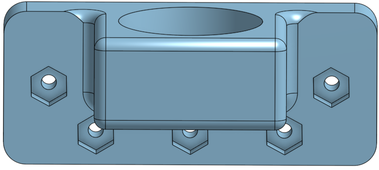 | 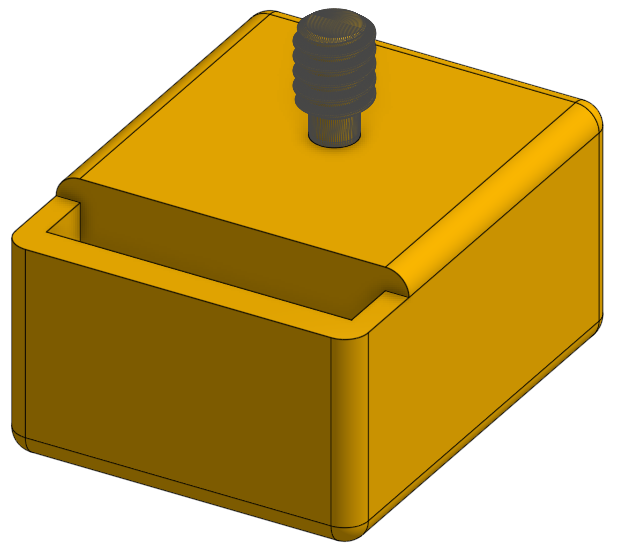 | 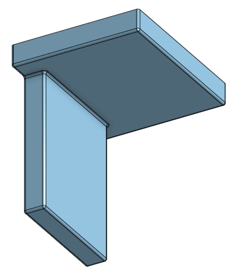 |

Rev 1
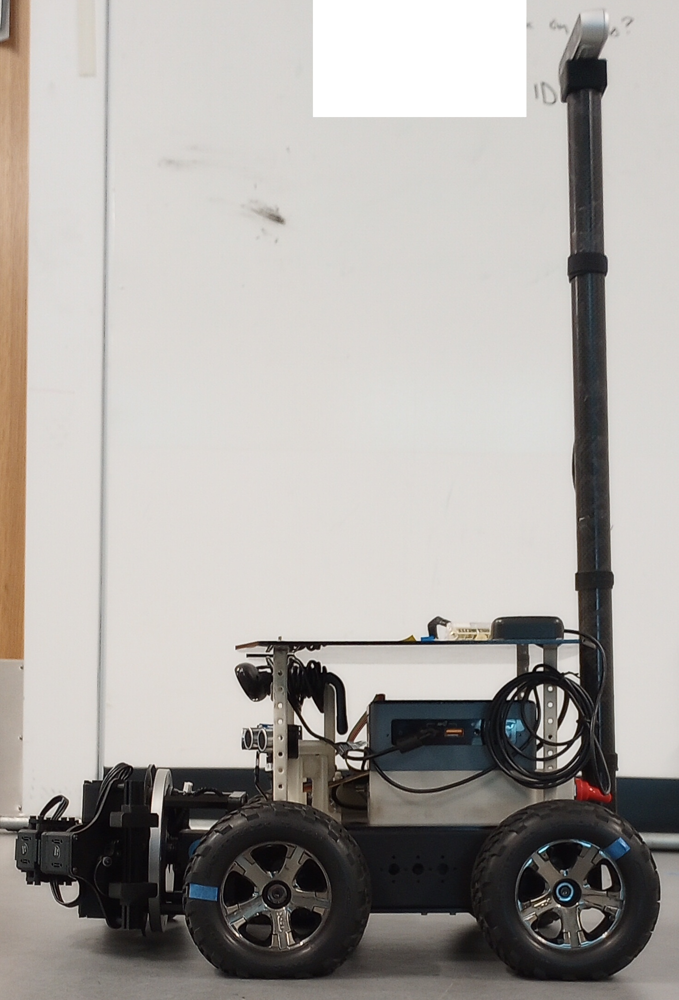

In the future thinking of putting a 2x2 Apriltag tag bundle on top of the camera 

## April Tag on Top of Intel Nuc 
For collecting data on localization we use Apriltags.  
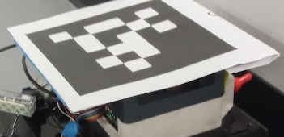