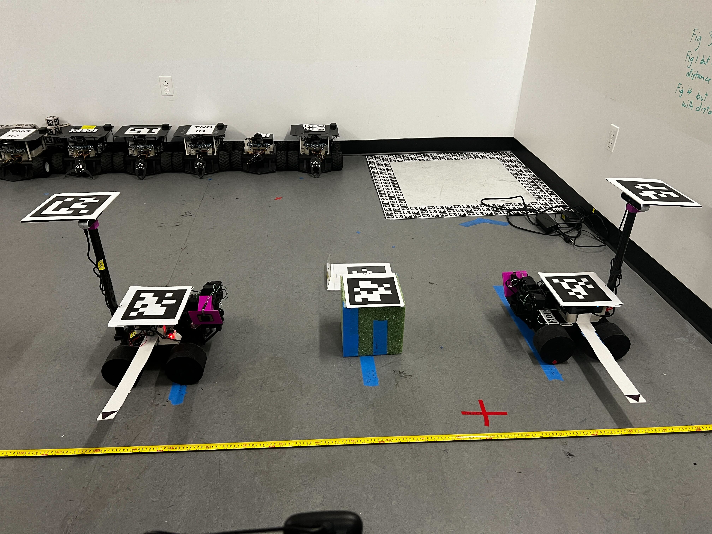
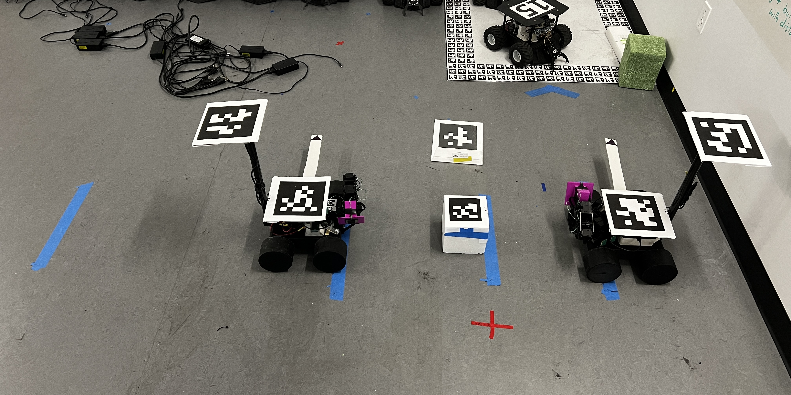

# Experiments
Document the goals and exact setup of each experiment here. Use as much detail as possible about the weight, dimensions, and distances, etc. of all objects in the scene. 

### Table of Contents

- [Experiment 0.1: Naive Attempt](#experiment-01-naive-attempt)
- [Experiment 0.2: Naive Attempt](#experiment-02-naive-attempt)
- [Experiment 0.3: Naive Attempt](#experiment-03-naive-attempt)
- [Experiment 0.4: Naive Attempt](#experiment-04-naive-attempt)
- [Experiment 0.5: Naive Attempt](#experiment-05-naive-attempt)


## Experiment 0.1: Naive Attempt

### Overview
- Manual operation of the base and arms using a velocity controller

## Experiment 0.2: Naive Attempt


### Overview
- Linear speed reduced by a factor of 16

### Monica Setup
Monica is running on ROS_DOMAIN_ID=1
```bash
ssh swarmie@monica.local -t /home/swarmie/MARIAM/misc/start_micro_ros_agent.sh
ssh swarmie@monica.local -t /home/swarmie/MARIAM/misc/start_robot.sh
```
### Ross Setup
Ross is running on ROS_DOMAIN_ID=2
```bash
ssh swarmie@ross.local -t /home/swarmie/MARIAM/misc/start_micro_ros_agent.sh
ssh swarmie@ross.local -t /home/swarmie/MARIAM/misc/start_robot.sh
```
### Laptop Setup
The home laptop is running on ROS_DOMAIN_ID=0 (default)
```bash
ros2 launch mariam_demos laptop_demo1.launch.py 
ros2 run domain_bridge domain_bridge ~/MARIAM/src/mariam_demos/domain_bridge_configs/experiment_1_bridge.yml 
ros2 bag record -a
```
### Physical Setup
- The center of the front tires of both agents are place 1.2 meters apart
- The center of the object is placed at the middle point of the previous distance
- A Styrofoam cube is used as the object
    - Weight (with tag):
    - Length x Width x Height: 8in x 8in x 8in
    - Not raised by stilts

### Trial Process
Experiment is run via manual control of the base and the arm using MoveIt position controller without path constraints. If the arms or base fail during start, that trail is skipped.
1. Arms are lifted to the height of the center of the object
2. Bases are moved forward until almost touching the object
3. Arms are moved forward until pressure is applied
4. Arms are moved upward until object is help and stable
5. Bases are driven forward about 0.6m and backwards home 0.6m

## Experiment 0.3: Naive Attempt

### Overview
- Base turning was disabled
- Linear speed reduced by a factor of 16

### Monica Setup
Monica is running on ROS_DOMAIN_ID=1
```bash
ssh swarmie@monica.local -t /home/swarmie/MARIAM/misc/start_micro_ros_agent.sh
ssh swarmie@monica.local -t /home/swarmie/MARIAM/misc/start_robot.sh
```
### Ross Setup
Ross is running on ROS_DOMAIN_ID=2
```bash
ssh swarmie@ross.local -t /home/swarmie/MARIAM/misc/start_micro_ros_agent.sh
ssh swarmie@ross.local -t /home/swarmie/MARIAM/misc/start_robot.sh
```
### Laptop Setup
The home laptop is running on ROS_DOMAIN_ID=0 (default)
```bash
ros2 launch mariam_demos laptop_demo1.launch.py 
ros2 run domain_bridge domain_bridge ~/MARIAM/src/mariam_demos/domain_bridge_configs/experiment_1_bridge.yml 
ros2 bag record -a
```
### Physical Setup
- The center of the front tires of both agents are place 1.2 meters apart
- The center of the object is placed at the middle point of the previous distance
- A Styrofoam cube is used as the object
    - Weight (with tag): 56.98g
    - Length x Width x Height: 5.9in x 5.9in x 5.9in
    - Not raised by stilts

### Trial Process
Experiment is run via manual control of the base and the arm using MoveIt position controller without path constraints. If the arms or base fail during start, that trail is skipped.
1. Arms are lifted to the height of the object
2. Bases are moved forward until almost touching the object
3. Arms are moved forward until pressure is applied
4. Arms are moved upward until object is help and stable
5. Bases are driven forward about 0.6m and backwards home 0.6m

## Experiment 0.4: Naive Attempt

### Overview


## Experiment 0.5: Naive Attempt


### Overview
- Base turning was disabled
- Linear speed reduced by a factor of 8
- First 15 trails done with monica driving forward
- Second 15 trials done with ross driving forward

### Monica Setup
Monica is running on ROS_DOMAIN_ID=1
```bash
ssh swarmie@monica.local -t /home/swarmie/MARIAM/misc/start_micro_ros_agent.sh
ssh swarmie@monica.local -t /home/swarmie/MARIAM/misc/start_robot.sh
```
### Ross Setup
Ross is running on ROS_DOMAIN_ID=2
```bash
ssh swarmie@ross.local -t /home/swarmie/MARIAM/misc/start_micro_ros_agent.sh
ssh swarmie@ross.local -t /home/swarmie/MARIAM/misc/start_robot.sh
```
### Laptop Setup
The home laptop is running on ROS_DOMAIN_ID=0 (default)
```bash
ros2 launch mariam_demos laptop_demo1.launch.py 
ros2 run domain_bridge domain_bridge ~/MARIAM/src/mariam_demos/domain_bridge_configs/experiment_1_bridge.yml 
ros2 bag record -a
```
### Physical Setup
- The center of the front tires of both agents are place 0.95 meters apart
- The center of the object is placed at the middle point of the previous distance
- A Styrofoam cube is used as the object
    - Weight (with tag): 56.98g
    - Length x Width x Height: 5.9in x 5.9in x 5.9in
    - Not raised by stilts

### Trial Process
Experiment is run via manual control of the base and the arm using MoveIt position controller without path constraints. If the arms or base fail during start, that trail is skipped.
1. Arms are lifted to the height of the object
2. Bases are moved forward until almost touching the object
3. Arms are moved forward until pressure is applied
4. Arms are moved upward until object is held and stable
5. Bases are driven forward 2m
