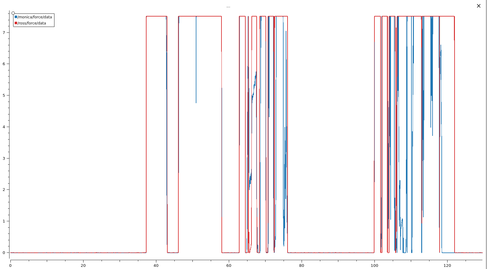
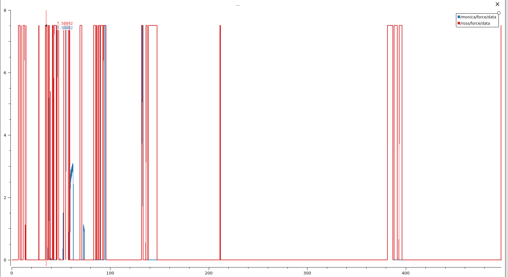
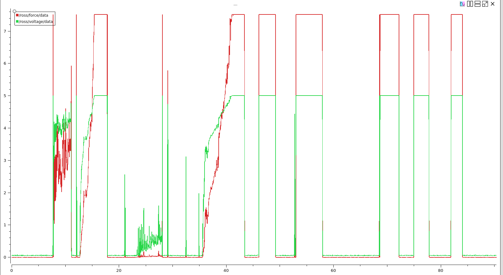

# Resistor Tests with the Force Sensor
The Interlink 406 Force Sensing Resistor does not appear to be sensitive enough for our experiments. We originally attached a 10k Ohm Resistor to the Teensy on both robots, but when looking at the force data in the ROS bags, it appeared to be at
its maximum value for most of the time that the robots were in contact with the object. I switched the resistor on Ross to a 100k Ohm one and then a 470k Ohm resistor, and the results were nearly the same. The force measurement is along the y-axis and time is along the bottom. 

### Test with 100k Ohm Resistor on Ross and 10k Ohm Resistor on Monica

### Test with 470k Ohm Resistor on Ross and 10k Ohm Resistor on Monica
 

### Test with 470k Ohm Resistor on Ross and varying weights
For this test, I used different weights placed on top of the force sensor (where the arm was pointing upwards). The most sloping force data came from the 50 g resistor, but due to the drift of the sensor, it was not stable. 
The force sensor was not able to detect force for all the weights less than 50 g (20g, 10 g, 5 g), and it maxed out for all the weights above 50 g (100 g, 200 g, 500 g, and 1k g) as soon as they were placed on it.

